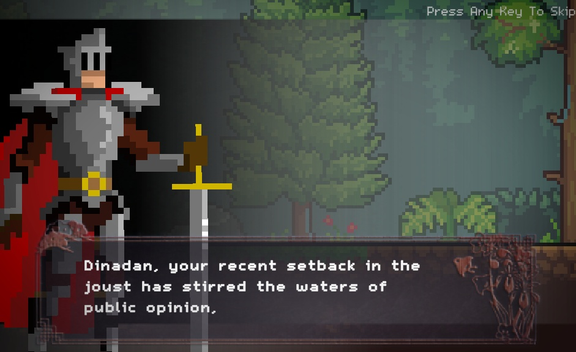

# Sir Dinadan's Quest

A small, fun 2D pixel-art game following the beloved Sir Dinadan. Developed as part of the **CM3030 Games Development** coursework for the University of London.

### 🎮 How to Play

**Option 1: Play Live in Browser**
**[Click here to play the WebGL build instantly via GitHub Pages!](https://ladyfaye1998.github.io/SirDinadan-sQuest/)**

**Option 2: Play Locally (Windows)**
To run the pre-compiled native build on your machine:
1. Click the green **Code** button at the top of this repository and select **Download ZIP**.
2. Extract the downloaded folder to your local drive.
3. Open the folder and double-click `Sir Dinadan's Quest.exe` to launch the game.

### 📜 The Legend of Sir Dinadan
In Arthurian legend—particularly within the Prose *Tristan* and Thomas Malory's *Le Morte d'Arthur*—Sir Dinadan stands out as the pragmatic, satirical voice of reason among the Knights of the Round Table. Renowned for his sharp wit and pragmatic humor, Dinadan famously rejected the exaggerated tropes of courtly love and the senseless injuries of jousting. This game brings his pragmatic approach to medieval life into an interactive, pixel-art format.

### 🕹️ Controls
* **Movement:** Keyboard (WASD / Arrows)
* **Combat:** Right-click the mouse to fight. *(Note: Dinadan cannot run from his current duel; you must win the sword fight to continue!)*

### 🏗️ Technical Architecture & Code Context
This project was built in **Unity 2D** utilizing **C#** for core game logic, state management, and combat mechanics, alongside custom ShaderLab/HLSL implementations for visual rendering. 

**DevSecOps CI/CD Integration:**
The live web version is fully automated using a custom GitHub Actions pipeline. The cloud-native architecture performs headless engine compilation via GameCI, dynamically injects C# Editor scripts to override Unity's default WebGL Brotli compression at runtime, and deploys the compiled HTML5 artifacts directly to GitHub Pages.

*Note: All visual assets and 2D pixel sprites utilized in this build are free assets sourced from the [Unity Asset Store](https://assetstore.unity.com/).*

### 🤝 Collaborations & Future Development
I am always open to collaborations! My current technical focus is bridging AI architecture with creative development. Moving forward, I am actively expanding my skillset into graphic design and both 2D and 3D world-building for future game development projects.
